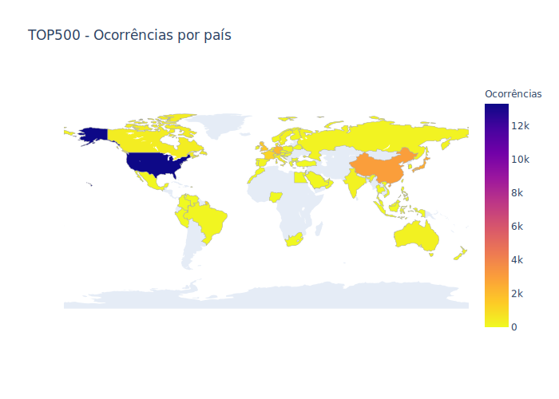

<!-- antes de enviar a versão final, solicitamos que todos os comentários, colocados para orientação ao aluno, sejam removidos do arquivo -->

# Exploração e Análise de Dados dos Supercomputadores Listados no Top500

#### Aluno: [Maicon Melo Alves](https://github.com/maiconmelo).
#### Orientadora: [Evelyn Conceição Santos Batista](https://github.com/link_do_github).

---

Trabalho apresentado ao curso [BI MASTER](https://ica.puc-rio.ai/bi-master) como pré-requisito para conclusão de curso e obtenção de crédito na disciplina "Projetos de Sistemas Inteligentes de Apoio à Decisão".

- [Link para o código](https://github.com/link_do_repositorio/nome_do_arquivo_de_codigo). <!-- caso não aplicável, remover esta linha -->

---

### Resumo

<!-- trocar o texto abaixo pelo resumo do trabalho, em português -->

### Abstract <!-- Opcional! Caso não aplicável, remover esta seção -->

<!-- trocar o texto abaixo pelo resumo do trabalho, em inglês -->

### Introdução
A **Computação de Alto Desempenho** (*High Performance Computing*) tem sido usada há decadas como um recurso fundamental para alavancar as pesquisas realizadas em áreas como biologia, física, química, estudos climáticos, exploração e produção de petróleo, economia, entre várias outras. Essas áreas possuem problemas complexos que, por demandarem alto poder computacional, só podem ser resolvidos em tempo razoável utilizando um **supercomputador**. Essencialmente, um supercomputador é um aglomerado de servidores interconectados por uma rede de comunicação de alta velocidade que trabalham em conjunto para resolver um dado problema. 

Com os recentes avanços na área de Inteligência Artificial, a computação de alto desempenho também tem sido empregada no treinamento de complexos modelos de aprendizado profundo e por reforço. O processo de treinamento desses modelos exige uma alta demanda computacional, especialmente aqueles baseados em redes neurais convolucionais que são comumente utilizados para detectar padrões em imagens e vídeos. Por conta disso, a computação de alto desempenho, que antes era empregada apenas em grandes empresas ou institutos de pesquisa, tem despertado também o interesse em empresas de médio e pequeno porte que atuam nas mais diversas áreas. 

Com a finalidade de dar visibilidade a esse assunto, um grupo de autores decidiu, em 1993, compilar e manter uma lista dos 500 supercomputadores mais poderosos existentes no planeta. Essa lista é divulgada duas vezes ao ano (junho e novembro) e permite que especialistas, cientistas e fabricantes conheçam os recentes avanços tecnológicos obtidos nessa área. Essa lista é conhecida como **Top500** e pode ser acessada nesse [link](https://www.top500.org/). 

Mais do que um relatório sobre equipamentos e dispositivos, a Top500 indica quais são as tecnologias que estão na **vanguarda** da computação mundial, além de revelar o **posicionamento geopolítico** das nações em relação aos investimentos em **pesquisa científica**. De fato, como dito anteriormente, a evolução da pesquisa e desenvolvimento em algumas áreas está diretamente relacionada ao poder computacional disponível para resolver, em tempo hábil, problemas complexos.

### Objetivo

Por meio da extração, exploração e análise de dados dos supercomputadores listados em todas as edições no Top500, esse trabalho tem o objetivo de analisar e investigar os seguintes aspectos: 

- Evolução do posicionamento geopolítico dos países em relação a supercomputação
- Tendências atuais relacionadas às tecnologias de interconexão e processamento
- Adoção de dispositivos específicos para aceleração
- Inclinação ao uso de arquiteturas abertas ou proprietárias
- Mudanças nos paradigmas e técnicas empregadas nessa área
- Fatores que apresentam maior correlação com o desempenho obtido pelos supercomputadores
- Previsão para o rompimento da barreira de 1 Exaflop

### Extração

Os dados foram coletados diretamente do site [Top500](www.top500.org) por meio de um programa especificamente criado para esse fim. Como os dados só podem ser acessados após a autenticação do usuário, foi preciso implementar algumas técnicas de *web scraping* a fim de identificar o *token* utilizado na autenticação. 

Após realizar a autenticação do usuário, o programa executa o download e leitura de 56 arquivos no formato Excel, onde cada arquivo representa uma lista publicada pelo Top500. Todos esses dados foram armazenados em um único arquivo CSV para facilitar uma posterior análise. 

Inicialmente, a ideia era fazer um carregamento automático dos dados, ou seja, o programa efetuaria, automaticamente, tanto o download quanto leitura das informações, sem que fosse necessário realizar nenhum processamento manual dessas informações. Contudo, não foi possível implementar tal abordagem, pois há uma série de inconsistências entre grupos de arquivos. Diante disso, foi preciso realizar alguns ajustes manuais a fim de tornar o dado mais confiável, coerente e legível. 

### Visão Geral dos Dados

Composição:
- Listas: 56
- Período: 1993 a 2020
- Registros: 28000
- Atributos: 53

Descrição dos atributos:
- Rank: posição na lista
- Site: local em que o supercomputador está instalado 
- Manufacturer: fabricante
- Computer: nome ou modelo 
- Country: país
- Total Cores: quantidade total de núcleos de processamento
- RMax: desempenho máximo teórico em teraflops
- RPeak: desempenho máximo alcançado em teraflops
- Processor Technology: tecnologia do processador
- Processor: nome do processador
- System Family: modelo do sistema
- Operating System: sistema operacional
- Segment: área
- Application Area: área
- Interconnect Family: interconexão
- Interconnect: interconexão
- List: lista 
- Power: potência
- Accelerator: acelerador 
- Name
- Efficiency: eficiência
- Power Efficiency: eficiência energética

Vale ressaltar que esses atributos não estão disponíveis para todos os registros do conjunto de dados, já que algumas dessas informações foram introduzidas somente a partir de um determinado período. 

### Análise 

#### As nações e o seu posicionamento geopolítico em supercomputação

Para avaliar a representatividade das nações no contexto da supercomputação, foi apurado, para cada país, o total de supercomputadores que ocuparam alguma posição no Top500, considerando todas as 56 listas publicadas até hoje. O gráfico abaixo mostra um mapa . O mapa interativo pode ser visto nesse link.

A partir das informações exibidas nessa imagem, pode-se constatar o seguinte: 

- Todos os continentes
- Europa
- América latina é o brasil
- EUA e China

#### Fabricantes
Nuvem de palavras

#### Interconexão

#### Aceleradores

#### Diferença entre maior e menor do rank

### Quais fatores mais contribuem para um maior desempenho?
- Modelo de regressão para explicar 

### Previsão para Exaflop
- Criar modelo de previsão de séries temporais
- Previsão para 1 exaflop aconteceria quando?

---

Matrícula: 192.671.112

Pontifícia Universidade Católica do Rio de Janeiro

Curso de Pós Graduação *Business Intelligence Master*
