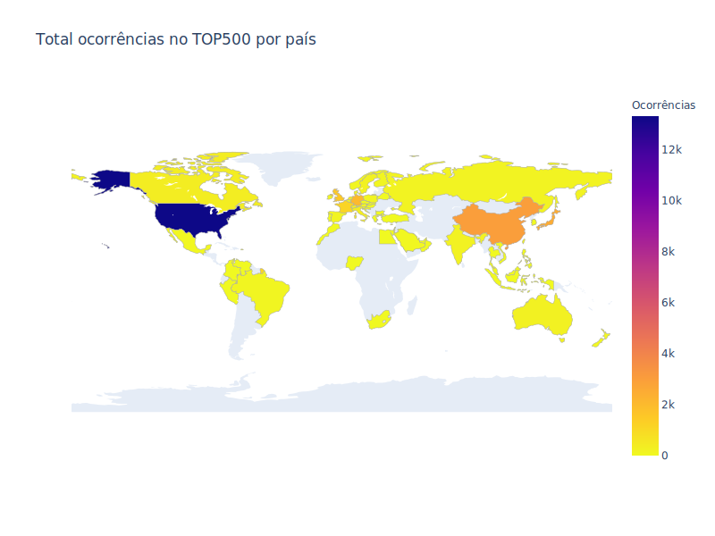
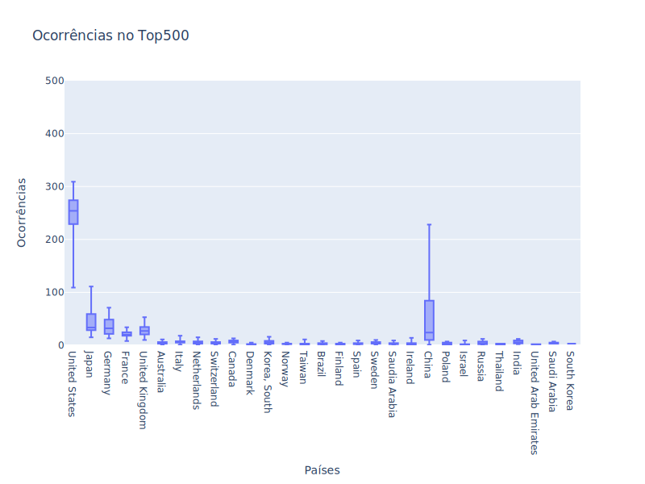
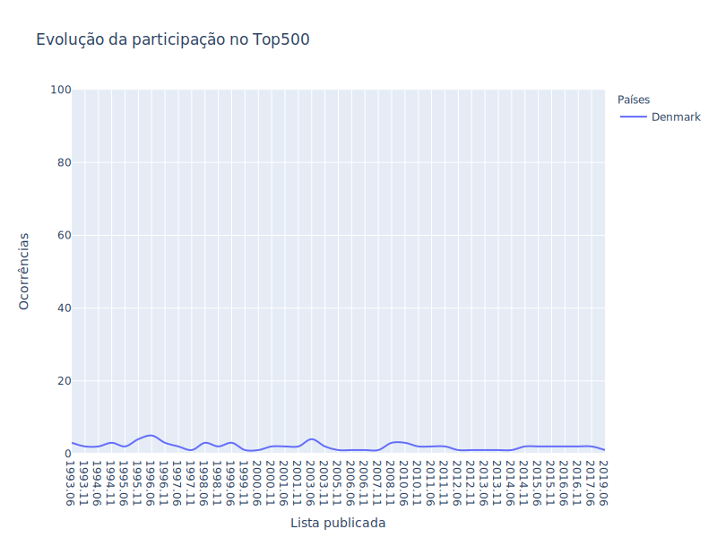
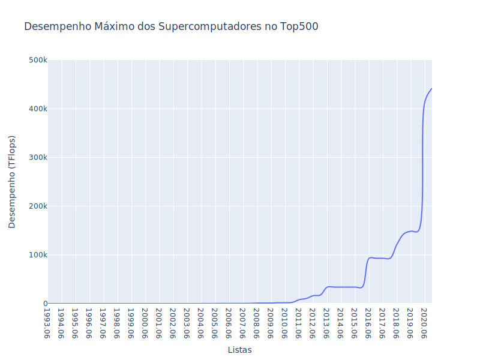
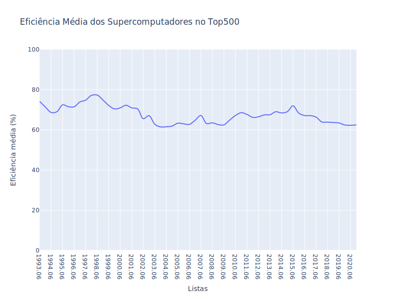
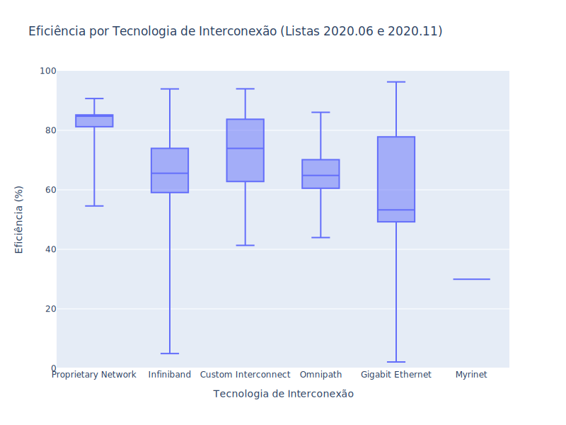

<!-- antes de enviar a versão final, solicitamos que todos os comentários, colocados para orientação ao aluno, sejam removidos do arquivo -->

# Análise de Dados dos Supercomputadores Listados no Top500

#### Aluno: [Maicon Melo Alves](https://github.com/maiconmelo).
#### Orientadora: [Profa. Evelyn Conceição Santos Batista](https://github.com/evysb).

---

Trabalho apresentado ao curso [BI MASTER](https://ica.puc-rio.ai/bi-master) como pré-requisito para conclusão de curso e obtenção de crédito na disciplina "Projetos de Sistemas Inteligentes de Apoio à Decisão".

---

### Resumo

<!-- trocar o texto abaixo pelo resumo do trabalho, em português -->

### Abstract <!-- Opcional! Caso não aplicável, remover esta seção -->

<!-- trocar o texto abaixo pelo resumo do trabalho, em inglês -->

### Introdução
A **Computação de Alto Desempenho** (*High Performance Computing* ou HPC) tem sido usada há decadas como um recurso fundamental para alavancar as pesquisas realizadas em áreas como biologia, física, química, estudos climáticos, exploração e produção de petróleo, economia, entre várias outras. Essas áreas possuem problemas complexos que, por demandarem alto poder computacional, só podem ser resolvidos em tempo razoável utilizando um **supercomputador**. Essencialmente, um supercomputador é um aglomerado de servidores interconectados por uma rede de comunicação de alta velocidade que trabalham em conjunto para resolver um dado problema. 

Com os recentes avanços na área de Inteligência Artificial, a computação de alto desempenho também tem sido empregada no treinamento de complexos modelos de aprendizado profundo e por reforço. O processo de treinamento desses modelos exige uma alta demanda computacional, especialmente aqueles baseados em redes neurais convolucionais que são comumente utilizados para detectar padrões em imagens e vídeos. Por conta disso, a computação de alto desempenho, que antes era empregada apenas em grandes empresas ou institutos de pesquisa, tem despertado também o interesse em empresas de médio e pequeno porte que atuam nas mais diversas áreas. 

Com a finalidade de dar visibilidade a esse assunto, um grupo de autores decidiu, em 1993, compilar e manter uma lista dos 500 supercomputadores mais poderosos existentes no planeta. Essa lista é divulgada duas vezes ao ano (junho e novembro) e permite que especialistas, cientistas e fabricantes conheçam os recentes avanços tecnológicos obtidos nessa área. Essa lista é conhecida como **Top500** e pode ser acessada nesse [link](https://www.top500.org/). 

Mais do que um relatório sobre equipamentos e dispositivos, a Top500 indica quais são as tecnologias que estão na **vanguarda** da computação mundial, além de revelar o **posicionamento geopolítico** das nações em relação aos investimentos em **pesquisa científica**. De fato, como dito anteriormente, a evolução da pesquisa e desenvolvimento em algumas áreas está diretamente relacionada ao poder computacional disponível para resolver, em tempo hábil, problemas complexos.

### Objetivo

Por meio da extração, exploração e análise de dados dos supercomputadores listados em todas as edições no Top500, esse trabalho tem o objetivo de: 

- Analisar o posicionamento geopolítico dos países no contexto da computação de alto desempenho
- Investigar a relação entre eficiência alcançada pelos supercomputadores e sua rede de interconexão
- Criação de modelo para previsão de poder computacional

### Extração dos Dados

Os dados foram coletados diretamente do site [Top500](www.top500.org) por meio de um programa especificamente criado para esse fim. Como os dados só podem ser acessados após a autenticação do usuário, foi preciso implementar algumas técnicas de *web scraping* a fim de identificar o *token* utilizado na autenticação. 

Após realizar a autenticação do usuário, o programa é capaz de executar o download e leitura de 56 arquivos no formato Excel, onde cada arquivo representa uma lista publicada pelo Top500. Todos esses dados foram armazenados em um único arquivo CSV para facilitar uma posterior análise. 

Como havia uma série de inconsistências entre grupos de arquivos, foi necessário realizar um pré-processamento manual nesses dados a fim de torná-los mais coerentes, legíveis e confiáveis. 

### Visão Geral dos Dados

**Composição:**
- Listas: 56
- Período: 1993 a 2020
- Registros: 28000
- Atributos: 9

**Descrição dos atributos:**
- `rank`: posição na lista
- `country`: país
- `rmax`: desempenho nominal em teraflops
- `processor_technology`: tecnologia do processador
- `interconnect_family`: tecnologia de interconexão
- `list`: edição da lista 
- `accelerator`: dispositivo acelerador 
- `efficiency`: eficiência alcançada pelo supercomputador

Vale ressaltar que esses atributos não estão disponíveis para todos os registros do conjunto de dados, já que algumas dessas informações foram introduzidas somente a partir de um determinado período. 

### Posicionamento geopolítico dos países no contexto da computação de alto desempenho

Para avaliar a representatividade das nações no contexto da supercomputação, foi apurado, para cada país, o total de supercomputadores que ocuparam alguma posição no Top500, considerando todas as 56 listas publicadas até hoje. O gráfico abaixo mostra esse quantitativo de ocorrências no Top500 por país. Uma versão interativa desse mapa pode ser acessada [aqui](codigo/html/ocorrencias_por_pais_mapa.html).

Ao analisar esse mapa, pode-se constatar o seguinte: 

- **Todos os continentes** tiveram algum país representante em alguma das 56 listas avaliadas. 
- Na américa latina, o **Brasil** se destaca entre os demais países. 
- Os **EUA** despontam como a nação que mais figurou no Top500, com mais de 13 mil ocorrências ao longo desses anos. 
- A **China** é o segundo país com mais ocorrências (aproximadamente 3 mil), embora esteja bem distante dos EUA. 

Esses dados mostram a representatividade das nações no Top500 considerando o total de ocorrências na lista. Contudo, as nações podem ter apresentado alguma variação em sua representatividade desde o início da lista até os dias atuais. A fim de investigar essa questão, a figura abaixo apresenta um gráfico *boxplot* dos países em que a mediana de ocorrências no Top500 foi maior do que 1. 

A amplitude interquartil (diferença entre o primeiro e terceiro quartis) mostra que a variação de ocorrências no Top500 é muito pequena para a grande maioria dos países. De fato, tomando a Dinamarca como exemplo, pode-se verificar que a variação em torno da mediana - que é igual a 2 ocorrências - realmente é quase inexistente, como pode ser visto nessa imagem: 

Em contrapartida, observa-se uma variação muito maior para os EUA, China e Japão. Como pode ser visto na figura a seguir, o Japão apresentou um declínio desde a sua primeira participação na lista até a edição publicada em 2008, apresentando, a partir daquele ano, uma participação mais constante e bem menos expressiva do que aquela que foi observada nos primeiros anos do Top500. 

Quanto aos EUA e China, o gráfico evidencia que os EUA entraram em franco declínio em 2015, ao passo que a China aumentou significativamente sua participação também a partir daquele ano. Essa tendência de inversão se consolida após 2017, onde a China passa a ter uma maior participação do que os EUA nas últimas 8 edições da lista. 

### Eficiência dos supercomputadores em relação a sua rede de interconexão
A posição de um supercomputador no Top500 é determinada a partir do número de operações de ponto flutuante executadas por segundo (**FLOPS - Floating Point Operations per Second**). Portanto, quanto maior for esse número, maior será a posição ocupada pelo supercomputador nesse *ranking*. O supercomputador **Fugaku**, por exemplo, foi capaz de executar 442 quadrilhões de operações de ponto flutuante por segundo, resultado que o fez ocupar a primeira posição na última lista divulgada pelo Top500 (novembro de 2020). Como pode ser visto na imagem abaixo, **o desempenho nominal** dos supercomputadores tem crescido exponencialmente nesses últimos 27 anos. 

Embora o *ranking* seja determinado de acordo com o desempenho nominal dos supercomputadores, há também o interesse em avaliar o quão **eficientemente** um equipamento é capaz de utilizar todos os seus recursos de processamento. Dessa forma, pode-se entender quais são os gargalos ou entraves que impedem que um supercomputador alcance seu desempenho máximo teórico. No contexto do Top500, a **eficiência** é calculada como a razão entre o desempenho **nominal** e o desempenho **máximo teórico**.  

Diferentemente do desempenho nominal, que tem crescido ao longo do tempo, a eficiência média tem se mantida estável, como pode ser visto na figura abaixo. Na verdade, ao analisar atentamente o gráfico, pode-se notar que a eficiência média tem apresentado um leve declínio a partir de 2015. De fato, em novembro de 2020 a eficiência média foi igual a 62,48% que é um valor bem próximo da mínima histórica de 61,55%. 

A eficiência de um supercomputador depende de diversos fatores que variam desde a tecnologia do hardware que compõe o equipamento até as pilhas de software utilizadas para gerenciar a máquina. Dessa forma, considerando apenas as informações resumidas que são disponibilizadas pelo site, não é plausível realizar uma investigação mais profunda sobre quais seriam os fatores que verdadeiramente influenciam a eficiência dos supercomputadores listados no Top500.

Entretanto, como é de conhecimento da comunidade de HPC, um dos fatores que mais contribuem para que um supercomputador alcance um bom desempenho é a **rede de interconexão** utilizada para conectar os seus servidores ou nós de processamento. Assim sendo, pode-se avaliar a hipótese de que a **eficiência obtida por um supercomputador listado no Top500 esteja relacionada a tecnologia da sua rede de interconexão**. 

Para analisar essa hipótese, foram estratificados os dados de eficiência e tecnologia de interconexão dos supercomputadores listados nas últimas duas edições publicadas pelo Top500, ou seja, as listas de junho e novembro de 2020, como pode ser visto na figura abaixo. Optou-se por restringir esse conjunto de dados aos supercomputadores dessas duas listas para evitar que os testes estatísticos fossem influenciados por amostras que tivessem um númeroro muito grande de elementos. 

Dentre as tecnologias de interconexão utilizadas pelos supercomputadores dessas edições da lista, foram selecionadas as redes **Gigabit Ethernet** e **Infiniband** para avaliar essa questão. Essas redes foram escolhidas, pois apresentam diferentes médias de eficiência e um número de elementos razolável, ao contrário, por exemplo, da rede **Proprietary Network** que possui apenas 14 elementos nessa amostra. 

Com a finalidade de amenizar os efeitos que outros fatores poderiam incutir na eficiência, os supercomputadores que utilizam essas duas redes foram filtrados de forma que utilizassem a mesma tecnologia do processador. Coincidentemente, em ambos os casos, a tecnologia de processador mais utilizada é exatamente a mesma: **Intel Skylake**. Além de igualar a tecnologia do processador, foram selecionados apenas os supercomputadores que não fossem dotados de dispositivos aceleradores. 

Após todo esse processo, as seguintes amostras foram selecionadas: 

**Amostras:**

Gigabit Ethernet: 
- Tamanho: 159
- Média: 47,79
- Mediana: 51,34
- Máximo: 60,34
- Mínimo: 22,81
- Desvio Padrão: 10,52

Infiniband: 
- Tamanho: 41
- Média: 59,60
- Mediana: 62,3
- Máximo: 67,65
- Mínimo: 4,97
- Desvio Padrão: 13,03

**Hipóteses:**
- H0: A eficiência média entre os supercomputadores que utilizam as redes Gigabit Ethernet e Infiniband são **iguais**. 
- HA: A eficiência média entre os supercomputadores que utilizam as redes Gigabit Ethernet e Infiniband são **diferentes**. 

**Tipo de teste:**

Para testar essas hipóteses, foi aplicado o **teste T para amostras independentes** considerando uma significância estatística (alfa) de 5%. Antes de executar o teste, foi verificado que as variâncias das amostras podem ser consideradas iguais, já que o valor-p do teste de **Levene** foi igual a 0,44445406530667875, ou seja, maior do que 0,05. 

**Resultado:**
- Estatística T: -6,090534920203153
- Valor-p: 0,00000000057536463877

**Interpretação:**

O teste de hipótese permitiu concluir que, com um nível de significância estatística de 5%, há indícios suficientes para **refutar a hipótese de que a eficiência média dos supercomputadores que utilizam as redes Gigabit Ethernet e Infiniband sejam iguais** para o contexto apresentado nesse trabalho. Sendo assim, é possível afirmar que os supercomputadores que utilizam a rede Infiniband foram capazes de obter uma maior eficiência média dos que utilizam a rede Gigabit Ethernet. 

Naturalmente, essa análise deve ser vista mais como um indício que corrobora com o entendimento geral de que as redes de interconexão são parte fundamental de um supercomputador, não somente ao que tange o desempenho nomimal, mas também a respeito da eficiência alcançada pelo equipamento. 

### Modelo para previsão de desempenho computacional
Na última lista divulgada pelo Top500, em novembro de 2020, todos os supercomputadores presentes no ranking atingiram mais de mil Teraflops de desempenho nominal, sendo que o supercomputador Fugaku, primeiro colocado na lista, alcançou a impressionante marca de 442 mil Teraflops de poder computacional. Esses dados evidenciam que a barreira de **1 Exaflop**, que equivale a 1 milhão de Teraflops, deve ser superada muito em breve. Mais do que um mero resultado técnico,  tem um significado mais amplo mportante marco na história da computação que se reflete nas novas possibilidades de pesquisa

Dada a importância desse assunto, esse trabalho utilizou a **série histórica de desempenho nominal** dos primeiros colocados no Top500 para criar modelo que fosse capaz de prever quando a marca de 1 Exaflop de desempenho nominal seria alcançada. Esse modelo foi criado a partir do treinamento de uma rede neural recorrente (*Recorrent Neural Network*) com arquitetura LSTM (*Long Short Term Memory*) que, dentre outros propósitos, vem sendo usada para realizar a predição de séries temporais. 

A partir de tal ano...

**Série temporal**
- Período: junho de 2008 à novembro de 2020
- Registros: 26 
- Dimensão de tempo: edições semestrais

gráfico. 

**Parâmetros**
- Janela de previsão: 2, 4 e 6
- Divisão dos dados: 70% para treinamento e 30% para teste
- Otimizadores: adam e sgd
- Neurônios: 16, 32, 64, 128 e 256
- Épocas: 1000, 2000, 3000 
- Métricas avaliadas: RMSE e MAPE

**Melhor modelo**

O melhor modelo foi obtido

gráfico

**Previsão para 1 Exaflop**

---

Matrícula: 192.671.112

Pontifícia Universidade Católica do Rio de Janeiro

Curso de Pós Graduação *Business Intelligence Master*
