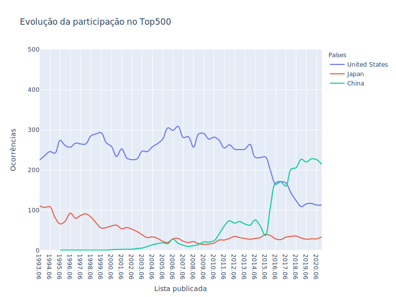

<!-- antes de enviar a versão final, solicitamos que todos os comentários, colocados para orientação ao aluno, sejam removidos do arquivo -->

# Exploração e Análise de Dados dos Supercomputadores Listados no Top500

#### Aluno: [Maicon Melo Alves](https://github.com/maiconmelo).
#### Orientadora: [Profa. Evelyn Conceição Santos Batista](https://github.com/evysb).

---

Trabalho apresentado ao curso [BI MASTER](https://ica.puc-rio.ai/bi-master) como pré-requisito para conclusão de curso e obtenção de crédito na disciplina "Projetos de Sistemas Inteligentes de Apoio à Decisão".

---

### Resumo

<!-- trocar o texto abaixo pelo resumo do trabalho, em português -->

### Abstract <!-- Opcional! Caso não aplicável, remover esta seção -->

<!-- trocar o texto abaixo pelo resumo do trabalho, em inglês -->

### Introdução
A **Computação de Alto Desempenho** (*High Performance Computing*) tem sido usada há decadas como um recurso fundamental para alavancar as pesquisas realizadas em áreas como biologia, física, química, estudos climáticos, exploração e produção de petróleo, economia, entre várias outras. Essas áreas possuem problemas complexos que, por demandarem alto poder computacional, só podem ser resolvidos em tempo razoável utilizando um **supercomputador**. Essencialmente, um supercomputador é um aglomerado de servidores interconectados por uma rede de comunicação de alta velocidade que trabalham em conjunto para resolver um dado problema. 

Com os recentes avanços na área de Inteligência Artificial, a computação de alto desempenho também tem sido empregada no treinamento de complexos modelos de aprendizado profundo e por reforço. O processo de treinamento desses modelos exige uma alta demanda computacional, especialmente aqueles baseados em redes neurais convolucionais que são comumente utilizados para detectar padrões em imagens e vídeos. Por conta disso, a computação de alto desempenho, que antes era empregada apenas em grandes empresas ou institutos de pesquisa, tem despertado também o interesse em empresas de médio e pequeno porte que atuam nas mais diversas áreas. 

Com a finalidade de dar visibilidade a esse assunto, um grupo de autores decidiu, em 1993, compilar e manter uma lista dos 500 supercomputadores mais poderosos existentes no planeta. Essa lista é divulgada duas vezes ao ano (junho e novembro) e permite que especialistas, cientistas e fabricantes conheçam os recentes avanços tecnológicos obtidos nessa área. Essa lista é conhecida como **Top500** e pode ser acessada nesse [link](https://www.top500.org/). 

Mais do que um relatório sobre equipamentos e dispositivos, a Top500 indica quais são as tecnologias que estão na **vanguarda** da computação mundial, além de revelar o **posicionamento geopolítico** das nações em relação aos investimentos em **pesquisa científica**. De fato, como dito anteriormente, a evolução da pesquisa e desenvolvimento em algumas áreas está diretamente relacionada ao poder computacional disponível para resolver, em tempo hábil, problemas complexos.

### Objetivo

Por meio da extração, exploração e análise de dados dos supercomputadores listados em todas as edições no Top500, esse trabalho tem o objetivo de analisar e investigar os seguintes aspectos: 

- Posicionamento geopolítico dos países em relação a supercomputação
- Eficiência alcançada pelos supercomputadores
- Previsão para o rompimento da barreira de 1 Exaflop

### Extração

Os dados foram coletados diretamente do site [Top500](www.top500.org) por meio de um programa especificamente criado para esse fim. Como os dados só podem ser acessados após a autenticação do usuário, foi preciso implementar algumas técnicas de *web scraping* a fim de identificar o *token* utilizado na autenticação. 

Após realizar a autenticação do usuário, o programa executa o download e leitura de 56 arquivos no formato Excel, onde cada arquivo representa uma lista publicada pelo Top500. Todos esses dados foram armazenados em um único arquivo CSV para facilitar uma posterior análise. 

Inicialmente, a ideia era fazer um carregamento automático dos dados, ou seja, o programa efetuaria, automaticamente, tanto o download quanto leitura das informações, sem que fosse necessário realizar nenhum processamento manual dessas informações. Contudo, não foi possível implementar tal abordagem, pois há uma série de inconsistências entre grupos de arquivos. Diante disso, foi preciso realizar alguns ajustes manuais a fim de tornar o dado mais confiável, coerente e legível. 

### Visão Geral dos Dados

**Composição:**
- Listas: 56
- Período: 1993 a 2020
- Registros: 28000
- Atributos: 53

**Descrição dos atributos:**
- Rank: posição na lista
- Manufacturer: fabricante
- Country: país
- Total Cores: quantidade total de núcleos de processamento
- RMax: desempenho máximo teórico em teraflops
- RPeak: desempenho máximo alcançado em teraflops
- Processor Technology: tecnologia do processador
- Processor: nome do processador
- System Family: modelo do sistema
- Operating System: sistema operacional
- Segment: área
- Application Area: área
- Interconnect Family: interconexão
- Interconnect: interconexão
- List: lista 
- Power: potência
- Accelerator: acelerador 
- Efficiency: eficiência
- Power Efficiency: eficiência energética

Vale ressaltar que esses atributos não estão disponíveis para todos os registros do conjunto de dados, já que algumas dessas informações foram introduzidas somente a partir de um determinado período. 

### Posicionamento geopolítico das nações no contexto da supercomputação

Para avaliar a representatividade das nações no contexto da supercomputação, foi apurado, para cada país, o total de supercomputadores que ocuparam alguma posição no Top500, considerando todas as 56 listas publicadas até hoje. O gráfico abaixo mostra esse quantitativo de ocorrências no Top500 por país. Uma versão interativa desse mapa pode ser acessada [aqui](codigo/html/ocorrencias_por_pais_mapa.html).

Ao analisar esse mapa, pode-se constatar o seguinte: 

- **Todos os continentes** tiveram algum país representante em alguma das 56 listas avaliadas. 
- Na américa latina, o **Brasil** se destaca entre os demais países. 
- Os **EUA** despontam como a nação que mais figurou no Top500, com mais de 13 mil ocorrências ao longo desses anos. 
- A **China** é o segundo país com mais ocorrências (aproximadamente 3 mil), embora esteja bem distante dos EUA. 

Esses dados mostram a representatividade das nações no Top500 considerando o total de ocorrências na lista. Contudo, as nações podem ter apresentado alguma variação em sua representatividade desde o início da lista até os dias atuais. A fim de investigar essa questão, a figura abaixo apresenta um gráfico *boxplot* dos países em que a mediana de ocorrências no Top500 foi maior do que 1. 

A amplitude interquartil (diferença entre o primeiro e terceiro quartis) mostra que a variação de ocorrências no Top500 é muito pequena para a grande maioria dos países. De fato, tomando a Dinamarca como exemplo, pode-se verificar que a variação em torno da mediana - que é igual a 2 ocorrências - realmente é quase inexistente, como pode ser visto nessa imagem: 

Em contrapartida, observa-se uma variação muito maior para os EUA, China e Japão. Como pode ser visto na figura a seguir, o Japão apresentou um declínio desde a sua primeira participação na lista até a edição publicada em 2008, apresentando, a partir daquele ano, uma participação mais constante e bem menos expressiva do que aquela que foi observada nos primeiros anos do Top500. 

Quanto aos EUA e China, o gráfico evidencia que os EUA entraram em franco declínio em 2015, ao passo que a China aumentou significativamente sua participação também a partir daquele ano. Essa tendência de inversão se consolida após 2017, onde a China passa a ter uma maior participação do que os EUA nas últimas 8 edições da lista. 

Do ponto de vista geopolítico, 

Mais especificamente sobre o Brasil...

### Análise da eficiência dos supercomputadores
A posição de um supercomputador no Top500 é determinada a partir do número de operações de ponto flutuante executadas por segundo (**FLOPS - Floating Point Operations per Second**). Portanto, quanto maior for esse número, maior será a posição ocupada pelo supercomputador nesse *ranking*. O supercomputador **Fugaku**, por exemplo, foi capaz de executar 442 quadrilhões de operações de ponto flutuante por segundo, resultado que o fez ocupar a primeira posição na última lista divulgada pelo Top500 (novembro de 2020). Como pode ser visto na imagem abaixo, **o desempenho nominal** dos supercomputadores tem crescido exponencialmente nesses últimos 27 anos. 

Embora o *ranking* seja determinado de acordo com o desempenho nominal dos supercomputadores, há também o interesse em avaliar o quão **eficientemente** um equipamento é capaz de utilizar todos os seus recursos. Dessa forma, pode-se entender quais são os gargalos ou entraves que impedem que um supercomputador alcance seu desempenho máximo teórico. No contexto do Top500, a **eficiência** é calculada como a razão entre o desempenho **nominal** e o desempenho **máximo teórico**.  

Diferentemente do desempenho nominal, que tem crescido ao longo do tempo, a eficiência média tem se mantida estável, como pode ser visto na figura abaixo. Na verdade, ao analisar atentamente o gráfico, pode-se notar que a eficiência média tem apresentado um leve declínio a partir de 2015. De fato, em novembro de 2020 a eficiência média foi igual a 62,48% que é um valor bem próximo da mínima histórica de 61,55%. 

A eficiência de um supercomputador depende de diversos fatores que variam desde a tecnologia do hardware que compõe o equipamento até as pilhas de software utilizadas para gerenciar a máquina. Dessa forma, considerando apenas as informações resumidas que são disponibilizadas pelo Top500, não é plausível realizar uma investigação mais profunda sobre os fatores que influenciam a eficiência dos supercomputadores.

Entretanto, como é de conhecimento da comunidade que atua nessa área, um dos fatores que pode afetar a eficiência de um supercomputador é a tecnologia da **rede de interconexão** utilizada para conectar os diversos servidores ou nós de processamento que compõem a máquina. Para analisar essa hipótese, foram estratificados os dados de eficiência e tecnologia de interconexão dos supercomputadores que listados  nas últimas duas edições mais recentes, ou seja, as listas de junho e novembro de 2020. O gráfico *boxplot* a seguir mostra a distribuição da eficiência em relação a tecnologia de interconexão desses supercomputadores.

### Previsão para Exaflop
- Criar modelo de previsão de séries temporais
- Previsão para 1 exaflop aconteceria quando?
- Será que daria para chutar a chance dos países de alcançar primeiro?

---

Matrícula: 192.671.112

Pontifícia Universidade Católica do Rio de Janeiro

Curso de Pós Graduação *Business Intelligence Master*
